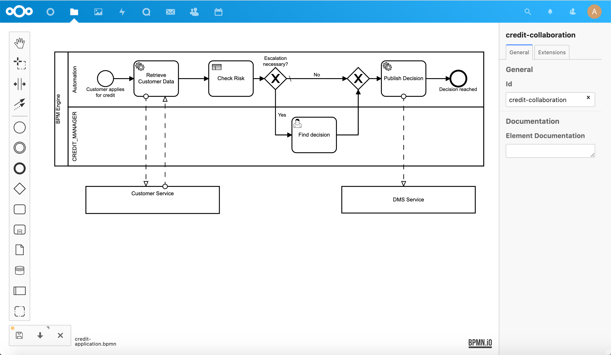

# BPMN/DMN Viewer and Editor for Nextcloud

View and edit [BPMN 2.0](https://www.omg.org/spec/BPMN/2.0.2/) and [DMN 1.3](http://www.omg.org/spec/DMN/About-DMN/) diagrams in [Nextcloud](https://nextcloud.com).

This app integrates the [BPMN.io editor](https://bpmn.io) into Nextcloud Files. 

## :heart_eyes: Features
This integration provides the following features:

* **Editor** Edit BPMN and DMN diagrams on every folder with write permission
* **Viewer** View BPMN and DMN diagrams if you have no write permission
* **New diagrams** Create new diagrams via the Nextcloud files app "New" menu

## :wave: About us
The BPM Files app is maintained by [processCentric GmbH](https://www.processcentric.ch/en/home/). You can learn more about the services we offer and the extended version of our modeling tool [here](https://www.processcentric.ch/en/training/process-modeling-1/modeling-tool/). 

## :rocket: Install it
The easiest way to install this app is by using the [Nextcloud app store](https://apps.nextcloud.com/apps/files_bpm).
If you would prefer to build it from source, the instructions are below.

To install the app, change into your Nextcloud's apps directory:

    cd nextcloud/workspace/server/apps-extra

Then run:

    git clone https://github.com/kirstenhh/nc-bpm-app.git files_bpm
  Note: double-check that the folder is now named files_bpm, otherwise the app won't show up in your Nextcloud apps.

Install the dependencies using:

    yarn install && composer install

Finally, build the assets using:

    yarn build
    
When the build is finished, you should see "BPM Files" in your Nextcloud apps. (You may need to clear the cache and refresh the page, and/or enable BPM Files).

If you are trying to extend the tool for your own usage, you will find resources and information about the bpmn-js modeler tool [here](https://github.com/bpmn-io/bpmn-js)

## :gear: Configuration
If you like to have previews of your BPM files, please install the [BPM preview
service][preview-service] on your server (requires root access) and add the
corresponding URL to your settings under admin settings > additional settings.

## :nerd_face: Release guide
This repo contains some Node scripts to simplify the release process on Linux
systems. They require openssl and gpg installed on your system and assume that
you have a valid [signing key] in `~/.nextcloud/certificates/files_bpm.key`.
Make sure that gpg and git is configured properly to use your default signing
key.

1. bump version in `package.json`
2. run `node scripts/build-release.js --stable` (for nightlies omit `--stable`)
3. `node scripts/publish-release.js` will generate a changelog from your
   commits, create and sign a release commit, and upload your app to Github and
   the Nextcloud app store

[signing key]: https://docs.nextcloud.com/server/stable/developer_manual/app_publishing_maintenance/code_signing.html
[preview-service]: https://github.com/Loydl/nc-bpm-preview-service
